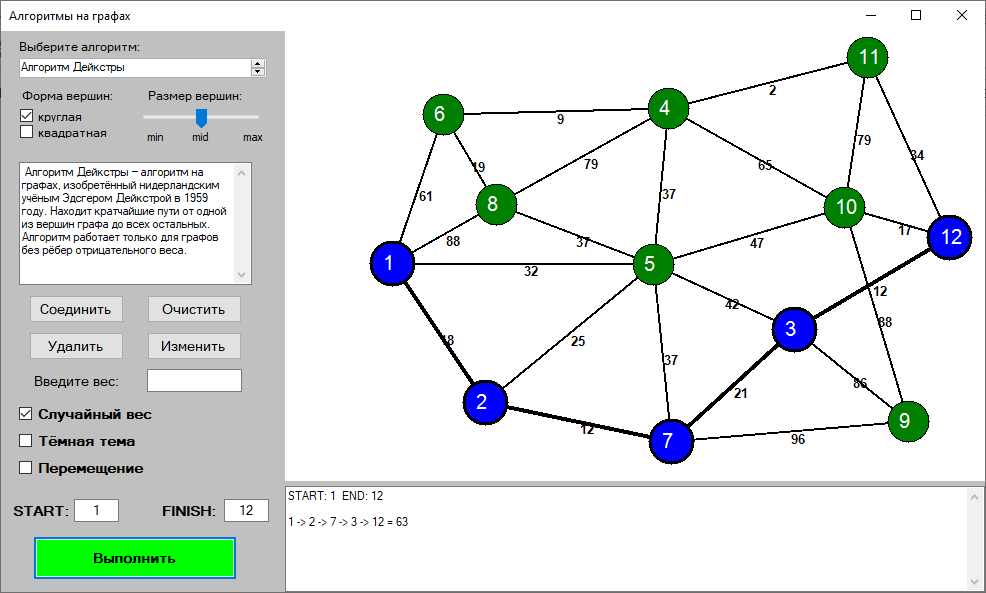

# Graph-Algorithms
___
## Description
This project was developed at the 2th semester (April-March 2020) of study at the _USATU_ (specialty of _Mathematical software and administration of information systems_) on the subject of _Algorithms and Data Structures_.

## Capabilities
This project include algorithms:
1. Kruskal's
2. DFS
3. BFS
4. Eulerian path
5. Dijkstra's

